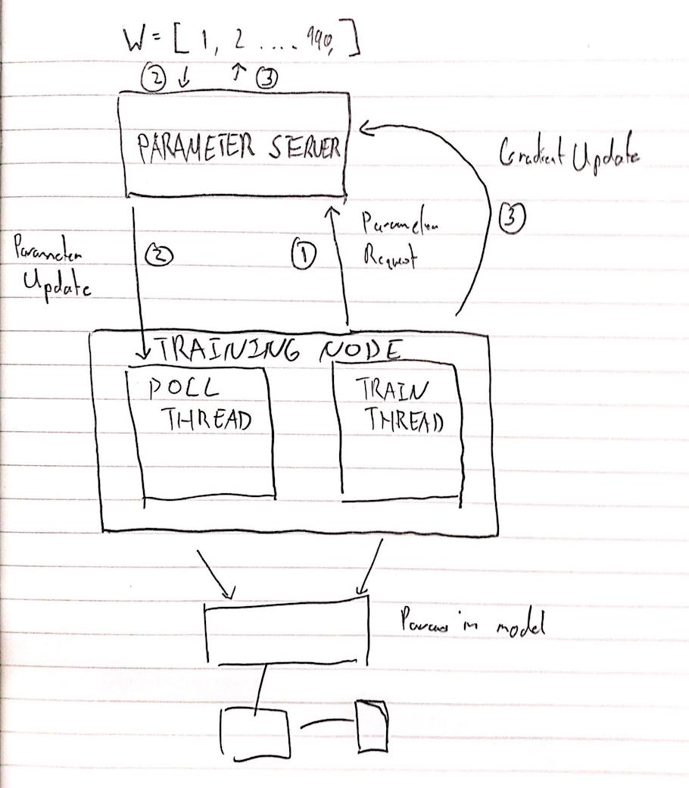

# distbelief
Implementing Google's DistBelief paper.

## Installation/Development instructions

You'll want to create a python3 virtualenv first by running `make setup`, after which, you should run `make install`. 
You'll then be able to use distbelief by importing distbelief
```python 

from distbelief.optim import DownpourSGD

optimizer = DownpourSGD(net.parameters(), lr=0.001, freq=50, model=net)

```

As an example, you can see our implementation running by using the script provided in `example/main.py`.

## Benchmarking

**NOTE:** we graph the train/test accuracy of each node, hence node1, node2, node3. A better comparison would be to evaluate the parameter server's params and use that value.
However we can see that the accuracy between the three nodes is fairly consistent, and adding an evaluator might put too much stress on our server. 

We scale the learning rate of the nodes to be learning_rate/freq (.03) .


We used AWS c4.xlarge instances to compare the CPU runs, and a GTX 1060 for the GPU run.

## DownpourSGD for PyTorch

DownpourSGD is pretty simple, there are two core concepts - a parameter server and a training node.

The parameter server is just a copy of the model parameters, it can get a gradient update or send parameters.

The training node asynchronously pulls the parameters, and then does your usual train step (compute loss, the backprop).
Once we've gotten the gradients, we send a copy to the parameter server, apply the update, and then continue training. 

### Sending messages

We're using `dist.isend` and `dist.recv` to send and receive tensors via PyTorch.

For any given model, we squash the parameters to a single parameter vector. The gradients for a backward pass are also the same size as this single parameter vector. 

This is the payload of our message. We also insert two extra element at the start of the vector, which describes what action we want to take with the data we send as well as the id of the sender.

### Parameter Server

We have a parameter server object, defined in `parameter_server.py`, which has two methods, `receive` and `run`.
- `run` simple polls until we receive a message (consisting of a message code and then some data). 
- `receive` then processes the message. 

There are two messages that the parameter server handles 
- `ParameterRequest`, which has a dummy payload - this is simply a request for parameters. When the server receives this message, it will send a `ParameterUpdate` message, which contains the current parameters. 
- `GradinetUpdate`, in which case the payload is a gradient update. In this case, we do a standard SGD gradient update, by updating our parameters. 

The parameter server also stores the model parameters as a single vector, which makes processing these two messages prety simple.

### Training

Our training node consists of two threads. The first thread simply polls, waiting for a `ParameterUpdate` from the server, at which point, it will overwrite the current model parameters. 

This code is defined in `downpour_sgd.py`. Like the parameter server, it has two methods, `receive` and `run`. 

`run` is the same as above, but the training node's `receive` only takes in one message, `ParameterUpdate`, at which point it will set the model params. Note that `set_params` will have to reshape the singular parameter vector. 

The second thread is the training thread, which trains as usual with two exceptions. 
- On every nth minibatch, we asynchronously pull the gradients. We do this by issuing a `ParameterRequest` message to the parameter server. Once the server receives this request, it will send a `ParameterUpdate` which the first thread will process. 
- After we compute the gradients, we issue a `GradientUpdate` message, which contains our gradients to the server. 

### Diagram


Here **2** and **3** happen concurrently. 

### References
- [Pytorch distributed tutorial](http://pytorch.org/tutorials/intermediate/dist_tuto.html)
- [Akka implementation of distbelief](http://alexminnaar.com/implementing-the-distbelief-deep-neural-network-training-framework-with-akka.html)
- [gevent actor tutorial](http://sdiehl.github.io/gevent-tutorial/#actors)
- [DistBelief paper](https://static.googleusercontent.com/media/research.google.com/en//archive/large_deep_networks_nips2012.pdf)
- [Analysis of delayed grad problem](https://openreview.net/pdf?id=BJLSGcywG)
